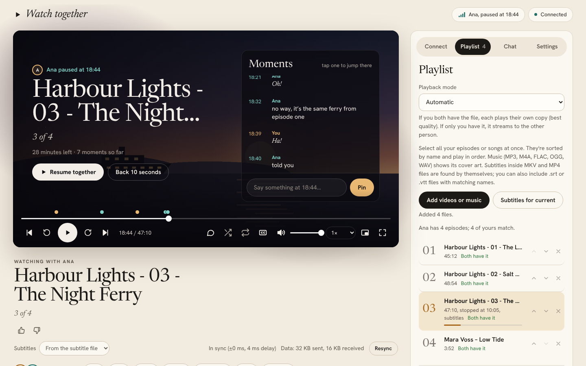
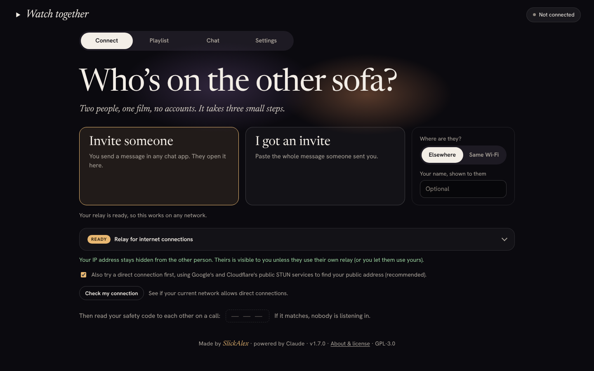

# Watch together

**Watch videos and listen to music in sync with a friend, browser to browser.**
End-to-end encrypted. No server, no account, nothing you have to install.

**▶ [Open Watch together](https://slickalex1.github.io/watch-together/)** in Chrome, Edge or Firefox, or [download it](../../releases/latest) to use it from a folder.

*Made by SlickAlex · powered by Claude · version 1.7.0 (beta) · [GPL-3.0](LICENSE)*

> **Beta:** Watch together works and is tested, but it hasn't been used on many devices yet. If something breaks, please [open an issue](../../issues/new/choose).

## What it does

- **Watch in sync.** Play, pause, seek, skip and change speed, and the other person follows. Small drifts are corrected automatically.
- **Your files, or streamed.**
  - If you both have the episode, each plays your own copy at full quality.
  - If only you have it, it streams live to the other person.
  - The **playback mode** lets you choose between these.
- **Movie sound browsers can't play.** AC-3, E-AC-3, DTS, TrueHD and more (common in MKV movies) are converted on your device and played in sync. Files with several sound tracks get a menu to pick the language.
- **Music too.** MP3, M4A, FLAC, OGG and WAV, with cover art, title and artist read from the file.
- **Playlists.** Episodes and songs play in order. There's loop, shuffle, like/dislike and "continue watching". You can also share your playlist so the other person can pick (and optionally edit).
- **Moments.** Every message and reaction is pinned to the second it happened, as a dot on the timeline. Tap one and you both go back to it.
- **A title card when you pause.** It says who paused and where, shows the moments so far and what's up next, and lets you say something right there.
- **Chat.**
  - Encrypted messages, with replies.
  - **Bullet chat**: messages fly across the video.
  - **Reactions with sound**: Ha!, Oh!, Aww, Bravo, Wah-wah, Boo and Ba-dum, in each person's own colour.
- **Day and night.** A warm light look for the day and a dark one for watching, following your device or chosen in Settings. While something plays, its colours glow softly around the player (you can turn this off).
- **Subtitles.** The ones inside MKV and MP4 files (SRT, ASS/SSA, WebVTT, MP4 text) appear in a **Subtitles** menu, and you can add `.srt` and `.vtt` files. Size and timing are adjustable.
- **Invitations with a preview.** A picture and a friendly message that the other person pastes into the app.
- **Works over the internet.** It connects directly when possible, or through a relay you choose. With a relay, IP addresses stay hidden.
- **Online or from a folder.** Open it from its web address, install it like an app on your phone or computer (it then works without internet too), or download it and open it as a file.
- **Notifications, picture-in-picture**, signal strength and data usage display, and keyboard shortcuts.

| Paused: who paused, the moments so far, what's next (day look) | Connecting in three small steps |
|---|---|
|  |  |

| Music with cover art | On a phone | Invitation picture |
|---|---|---|
|  |  |  |

## Quick start

1. **Open the app.** Either:
   - **Online:** open **https://slickalex1.github.io/watch-together/** in Chrome, Edge or Firefox. Nothing to download, and you can [install it](#install-it-as-an-app); or
   - **From a folder:** download the [latest release](../../releases/latest) and open **`app/index.html`**. On Android, open it through a file manager such as Cx File Explorer. Keep all the files of the `app` folder together.

   Both work the same way, and you can mix them: one person online, the other from a folder.
2. **Add something to watch.** In the **Playlist** tab, add your videos or music.
3. **Say where they are** (Connect tab, "Where are they?"):
   - **Elsewhere (over the internet).** Set up a free relay first ([below](#set-up-a-free-relay-over-the-internet)). Between two homes, phones or countries, a direct connection fails more often than it works, and the relay also hides your IP address. You do this once.
   - **Same Wi-Fi.** No relay needed.
4. **Connect, in three small steps.**
   1. One person taps **Invite someone** and sends the invitation (Share… or Copy) in any chat app.
   2. The other taps **I got an invite**, pastes the whole message, taps **Create reply** and sends the reply back.
   3. The first person pastes the reply and taps **Connect**.

   The steps light up as you go, so you can see who's waiting for whom.
5. **Compare the safety code** on a call. If it matches, nobody is in the middle, and chat unlocks.

Both people should use the same version of the app; it's shown at the bottom of the page. The online version is always the latest.

## Install it as an app

Opened online, Watch together can be installed like an app: it gets its own icon and a full-screen window, and opens even without internet.

- **Android (Chrome, Edge, Samsung Internet):** Settings → **Install as an app** → **Install**, or the browser menu → **Install app** / **Add to Home screen**.
- **iPhone and iPad:** in Safari, tap **Share** → **Add to Home Screen**.
- **Computer (Chrome, Edge):** the install icon at the right of the address bar, or Settings → **Install as an app**.

Updates arrive by themselves: the app checks for a newer version whenever it's opened with internet. To remove it, uninstall it like any other app.

## Set up a free relay (over the internet)

A relay (a "TURN server") passes your encrypted connection along when networks block a direct one, which mobile data and most home, school and office networks do. It can't see what you share. Only the person who starts the session needs one.

1. Create a free account with a TURN relay provider, for example [Metered Open Relay](https://www.metered.ca/tools/openrelay/). Many providers have free plans; check their current limits.
2. In the provider's dashboard, copy the **server address** (it looks like `relay.example.com:3478`), the **username** and the **password**. A "secret key" isn't needed.
3. Paste them into **Relay for internet connections** in the Connect tab (below the two big buttons) and tap **Test relay**. It should say "Relay works".
4. Tick **Remember these relay details** so you don't have to type them again.

With a relay:

- **Your IP address stays hidden** from the other person.
- **Your relay isn't shared by default.** You can let the other person use it for one session; the invitation then carries time-limited, encrypted access, and their IP is hidden too.
- **Temporary logins:** if your relay supports them (TURN REST API, e.g. a secret key), the relay itself refuses the shared login once the time is up.

Not sure whether you need one? Tap **Check my connection**. If the app says your network is "hard" (typical of mobile data), you do.

## Privacy and security

- **Everything between the two of you is encrypted end to end** (WebRTC: DTLS/SRTP): chat, reactions, playback commands and streams. The safety code proves no one is in the middle.
- **No servers, no accounts, no tracking.** Videos never leave your device unless you stream them to the person you're connected to.
- **The online version** is a plain page hosted by GitHub Pages. GitHub sees that your device loaded it, as with any website; after that, everything happens on your device and between the two of you.
- **Locked-down page:** a strict Content Security Policy only allows the app's own code. The page can't contact any website.
- **What others can see:**
  - The other person sees your IP address unless you use a relay.
  - Your relay provider and the optional STUN services see that two addresses are talking, but never what you share.
- **Saved in your browser only:**
  - settings, watch positions and likes;
  - relay details, if you choose;
  - online only: a copy of the app's own files, so it opens without internet.

  **Settings → Data saved in this browser** lists exactly what's stored right now and deletes all of it with one button. Your videos, music and chat are never saved, so there's nothing of them to delete.

To report a security problem, see [SECURITY.md](SECURITY.md).

## Video and music formats

**Pictures:** whatever your browser can decode: H.264, VP8, VP9 and AV1 everywhere; HEVC/x265 only on some devices.

**Sound:** the app plays every common format. When the browser can't play a file's sound itself, the app converts it **on your device** (nothing is uploaded) and plays it in sync with the picture:

| Plays everywhere | Converted by the app (sound inside video files) |
|---|---|
| AAC, MP3, Opus, Vorbis, FLAC | AC-3 (Dolby Digital), E-AC-3 (Dolby Digital Plus), DTS and DTS-HD, TrueHD, ALAC, WMA (incl. Pro and Lossless), WavPack, TTA, Monkey's Audio, MP1/MP2, AMR, ADPCM, A-law/µ-law, RealAudio, PCM |

Video files: MKV, MP4/M4V, MOV, AVI, WebM, MPEG-TS/M2TS, WMV and FLV. Plain music files play as the browser allows (MP3, AAC/M4A, FLAC, OGG/Opus and WAV work everywhere).

- **Several sound tracks** (for example English, Romanian and a commentary): every track in the file is listed in the **Audio** menu under the title, and any of them can be picked.
- **Subtitles inside the file:** listed in the **Subtitles** menu next to it (or press **C** / the CC button to turn on the first one). They're read in the background, starting where you're watching, so they appear within a second or two. Picture subtitles (PGS from Blu-ray, VobSub from DVD) are listed but can't be shown yet; an `.srt` file works instead.
- **Surround** is mixed down to stereo.
- **At speeds other than 1×**, converted sound plays slightly higher or lower in pitch.
- **When streaming**, the converted sound is sent along, so the other person hears it too.
- **Turning it off:** Settings → "Convert sound the browser can't play".

The converter is FFmpeg compiled to WebAssembly (see [tools/audio-decoder](tools/audio-decoder/README.md)); the same module repackages MKV videos for Firefox (below).

**Smoother MKV videos in Firefox:** Firefox's support for MKV files is new, and it plays them less smoothly than MP4. So in Firefox the app repackages MKV videos (H.264 and HEVC) as MP4 while they play: the picture is copied as it is, not re-encoded, and nothing is uploaded. It's the **Smoother MKV videos** setting (on by default in Firefox; you can turn it on in other browsers too). If repackaging doesn't work for a file, the app says so and plays it the usual way.

**If a video isn't playing smoothly**, the app tells you. HEVC and 10-bit videos are heavy for many devices. Converting to MP4 with H.264 always helps:

    ffmpeg -i movie.mkv -c:v libx264 -crf 20 -c:a aac movie.mp4

When streaming, only the person who has the file needs a browser that can play it.

## Troubleshooting

- **Connection fails:** over the internet, set up a relay first ([how](#set-up-a-free-relay-over-the-internet)). Tap **Check my connection** on both devices to see why a direct connection doesn't work.
- **Through a relay, the first try failed and the second worked:** fixed in 1.6.1. A relay can be slow to answer the first time, and older versions made the invite before it answered. The app now waits for it (you'll see "Waiting for the relay to answer…").
- **"Couldn't agree on video and audio formats":**
  1. Update both browsers.
  2. Use the same app version on both devices.
  3. Make a new invitation.
  4. If it still fails, tap **Copy details for the developer** and paste the result into a [bug report](../../issues/new/choose). It contains no addresses or passwords.
- **No sound from reactions on a phone:** tap the page once; phones only allow sound after a tap.
- **The other person hears no sound when you stream:** update both of you to version 1.5.1 or later (the online version is always up to date). Older versions sent sound only for the first file.
- **Sound stops after jumping in a video (phones):** from version 1.5.1 the app notices and recovers by itself, usually within a few seconds. If it keeps happening with one file, converting it to MP4 always helps (see below).
- **Notifications on Android:** they need the online version (or the installed app), or the page opened through an `http://localhost` address (Cx File Explorer does this). They don't work for a page opened as a file.
- **The installed app shows an old version:** close it completely and open it again with internet.

## For developers

    src/index.template.html   the whole app: HTML, CSS and JavaScript
    src/build.py              builds app/index.html (python3 build.py; add --min for a smaller file)
    src/minify.py             small minifier used by --min
    src/sw.js                 offline copy and notification helper (service worker)
    src/manifest.webmanifest  makes the online version installable; icons in src/icons/
    tools/make_icons.py       draws the icons
    tools/make_fonts.py       makes the two embedded typefaces (src/fonts/) small
    tools/make_demo_media.py  makes the invented demo episodes and song used for the screenshots
    .github/workflows/pages.yml  publishes the app online (GitHub Pages) on every change
    src/audio-decoder.worker.js  background worker that converts sound (packed into app/audio-decoder.js)
    tools/audio-decoder/      the sound converter and MP4 repackager: C source, compiled WebAssembly, build script, tests
    tests/                    smoke test, test media generator and a local test relay

Always edit `src/index.template.html` and rebuild. The page's security policy contains hashes of its own code, so a hand-edited `app/index.html` won't run. See [CONTRIBUTING.md](CONTRIBUTING.md) and [tests/README.md](tests/README.md).

**Your own online copy (forks):** in your fork, set **Settings → Pages → Source** to **GitHub Actions**. The workflow then publishes it at `https://<your-name>.github.io/<repository>/`, with your address in invitations.

## Legal

Watch together is free software under the **GNU General Public License v3** (or any later version): see [LICENSE](LICENSE). It comes **without any warranty**, and the authors aren't liable for how it's used.

**You're responsible for what you play, stream and share with it.** Only share content you have the right to share, and follow the laws where you live. More in [NOTICE.md](NOTICE.md).

The sound converter contains FFmpeg, licensed under the [LGPL 2.1 or later](licenses/LGPL-2.1.txt). The typefaces Newsreader and Hanken Grotesk are under the [SIL Open Font License 1.1](licenses/).

## Credits

Made by **SlickAlex**. Built with the help of Claude, an AI model by Anthropic. Anthropic isn't affiliated with this project. Sound conversion uses [FFmpeg](https://ffmpeg.org). Type: [Newsreader](https://github.com/productiontype/Newsreader) and [Hanken Grotesk](https://github.com/marcologous/hanken-grotesk), by their project authors, both under the SIL Open Font License.
