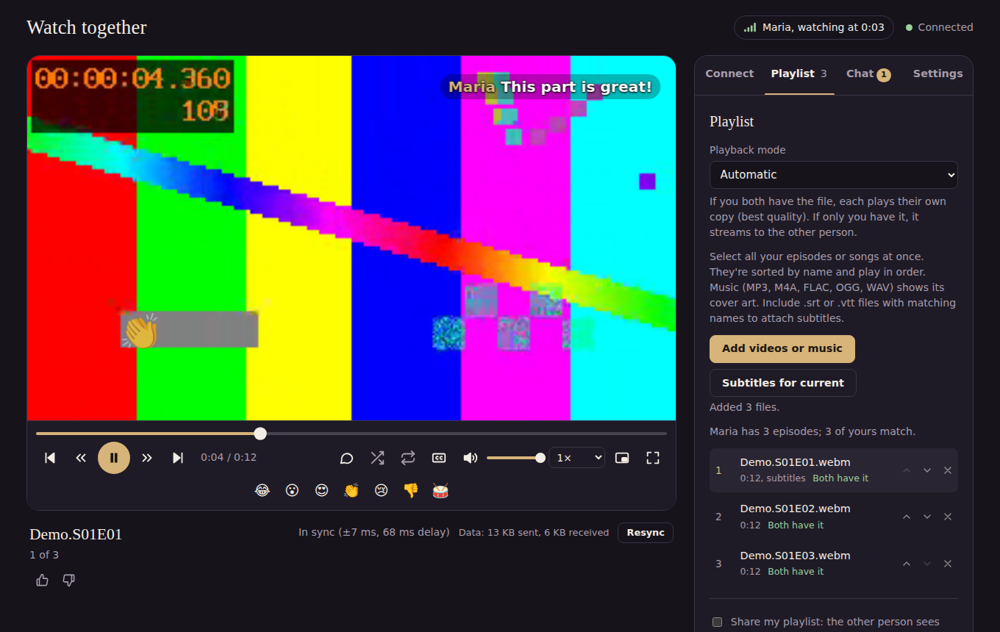
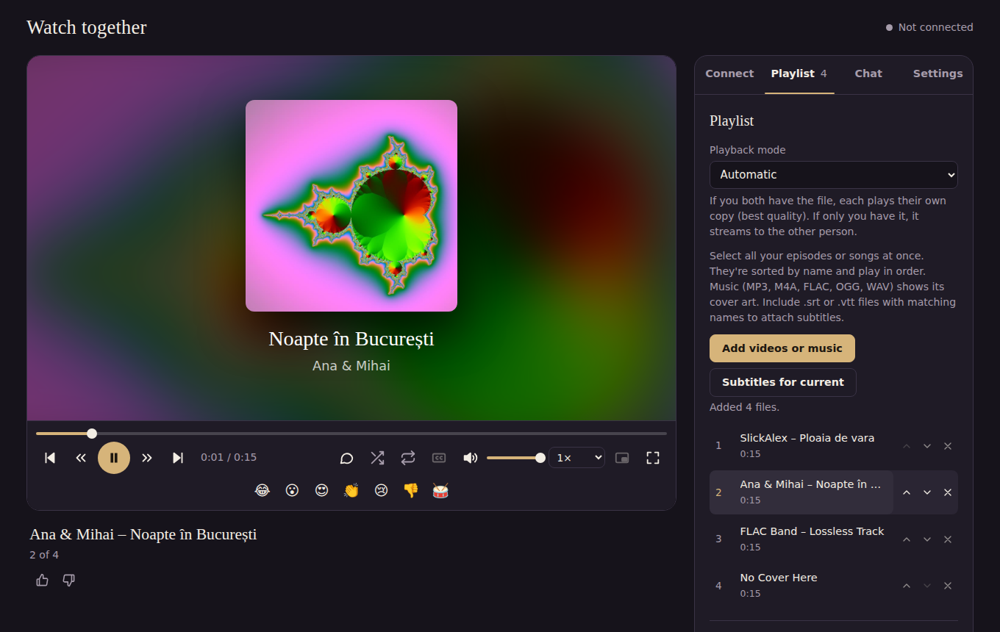
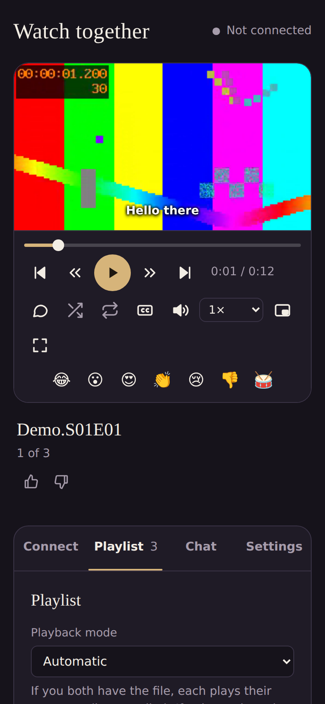
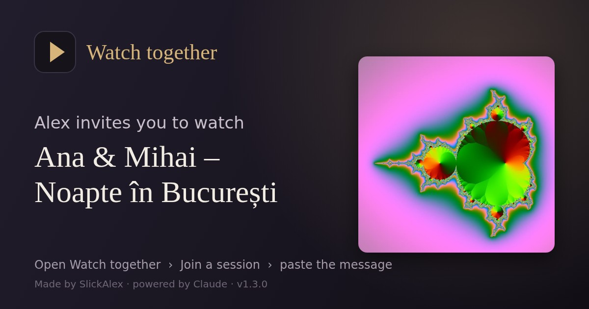

# Watch together

**Watch videos and listen to music in sync with a friend, browser to browser.**
End-to-end encrypted. No server, no account, nothing to install.

*Made by SlickAlex · powered by Claude · version 1.3.0 (beta) · [GPL-3.0](LICENSE)*

> **Beta:** Watch together works and is tested, but it hasn't been used on many devices yet. If something breaks, please [open an issue](../../issues/new/choose).

## What it does

- **Watch in sync.** Play, pause, seek, skip and change speed, and the other person follows. Small drifts are corrected automatically.
- **Your files, or streamed.**
  - If you both have the episode, each plays your own copy at full quality.
  - If only you have it, it streams live to the other person.
  - The **playback mode** lets you choose between these.
- **Music too.** MP3, M4A, FLAC, OGG and WAV, with cover art, title and artist read from the file.
- **Playlists.** Episodes and songs play in order. There's loop, shuffle, like/dislike and "continue watching". You can also share your playlist so the other person can pick (and optionally edit).
- **Chat.**
  - Encrypted messages, with replies.
  - **Bullet chat**: messages fly across the video.
  - **Reactions with sound**: applause, boo, laughter and more.
- **Subtitles.** `.srt` and `.vtt`, with adjustable size and timing.
- **Invitations with a preview.** A picture and a friendly message that the other person pastes into the app.
- **Works over the internet.** It connects directly when possible, or through a relay you choose. With a relay, IP addresses stay hidden.
- **Notifications, picture-in-picture**, signal strength and data usage display, and keyboard shortcuts.

| Music with cover art | On a phone | Invitation picture |
|---|---|---|
|  |  |  |

## Quick start

1. Download the latest release (or this repository) and open **`app/index.html`** in Chrome, Edge or Firefox. On Android, open it through a file manager such as Cx File Explorer.
2. **Playlist** tab: add your videos or music.
3. **Connect** tab: one person taps **Start a session** and sends the invitation (Share… or Copy) in any chat app. The other taps **Join a session**, pastes the whole message, and sends the reply back.
4. Compare the **safety code** on a call. If it matches, you're connected directly and privately, and chat unlocks.

Both people should use the same version of the app; the version is shown at the bottom of the page.

## Connecting over the internet

Many mobile and some Wi-Fi networks block direct connections. Tap **Check my connection** to see whether yours does. If it does, add a **TURN relay**: free accounts exist (for example at ExpressTURN or Metered).

1. Paste the relay's address, username and password into the Connect tab.
2. Tap **Test relay**.

With a relay:

- **Your IP address stays hidden** from the other person.
- **Your relay isn't shared by default.** You can let the other person use it for one session; the invitation then carries time-limited, encrypted access.
- **Temporary logins:** if your relay supports them (TURN REST API, e.g. a secret key), the relay itself refuses the shared login once the time is up.

## Privacy and security

- **Everything between the two of you is encrypted end to end** (WebRTC: DTLS/SRTP): chat, reactions, playback commands and streams. The safety code proves no one is in the middle.
- **No servers, no accounts, no tracking.** Videos never leave your device unless you stream them to the person you're connected to.
- **Locked-down page:** a strict Content Security Policy only allows the app's own code. The page can't contact any website.
- **What others can see:**
  - The other person sees your IP address unless you use a relay.
  - Your relay provider and the optional STUN services see that two addresses are talking, but never what you share.
- **Saved in your browser only:** settings, watch positions, likes and (if you choose) relay details.

To report a security problem, see [SECURITY.md](SECURITY.md).

## Video and music formats

Anything your browser plays works. MP4 (H.264 + AAC), WebM and MP3 work everywhere. Some MKV files (HEVC/x265 video, AC3/DTS audio) don't play in browsers; the app tells you which part is the problem. Convert them with ffmpeg:

    ffmpeg -i episode.mkv -c:v copy -c:a aac episode.mp4                   # no sound
    ffmpeg -i episode.mkv -c:v libx264 -crf 20 -c:a aac episode.mp4         # no picture

When streaming, the person who has the file needs a browser that can play it; the other person doesn't.

## Troubleshooting

- **Connection fails:** tap **Check my connection** on both devices. Mobile data usually needs a relay.
- **"Couldn't agree on video and audio formats":**
  1. Update both browsers.
  2. Use the same app version on both devices.
  3. Make a new invitation.
  4. If it still fails, tap **Copy details for the developer** and paste the result into a [bug report](../../issues/new/choose). It contains no addresses or passwords.
- **No sound from reactions on a phone:** tap the page once; phones only allow sound after a tap.
- **Notifications on Android:** they need the page opened through an `http://localhost` address (Cx File Explorer does this).

## For developers

    src/index.template.html   the whole app: HTML, CSS and JavaScript
    src/build.py              builds app/index.html (python3 build.py; add --min for a smaller file)
    src/minify.py             small minifier used by --min
    src/sw.js                 notification helper (service worker)
    tests/                    smoke test, test media generator and a local test relay

Always edit `src/index.template.html` and rebuild. The page's security policy contains hashes of its own code, so a hand-edited `app/index.html` won't run. See [CONTRIBUTING.md](CONTRIBUTING.md) and [tests/README.md](tests/README.md).

## Legal

Watch together is free software under the **GNU General Public License v3** (or any later version): see [LICENSE](LICENSE). It comes **without any warranty**, and the authors aren't liable for how it's used.

**You're responsible for what you play, stream and share with it.** Only share content you have the right to share, and follow the laws where you live. More in [NOTICE.md](NOTICE.md).

## Credits

Made by **SlickAlex**. Built with the help of Claude, an AI model by Anthropic. Anthropic isn't affiliated with this project.
